# Linux物理内存管理

在内存管理方面，操作系统除了担负管理页表映射的职责外，还担负着管理物理内 存资源的职责。各个应用进程在运行过程中都需要使用物理内存资源，操作系统需要为它们分配物理内存资源。

一方面，操作系统需要具备以物理页为粒度进行物理内存分配的能力，从而能够在应用进程的页表中填写虚拟页到物理页的映射。

另一方面，操作系统在运行的过程中会用到大量不同的结构体，许多结构体远小于一个物理页，因此也需要具备分配小内存区域的能力，否则将造成内存浪费。

## 0.物理内存结构

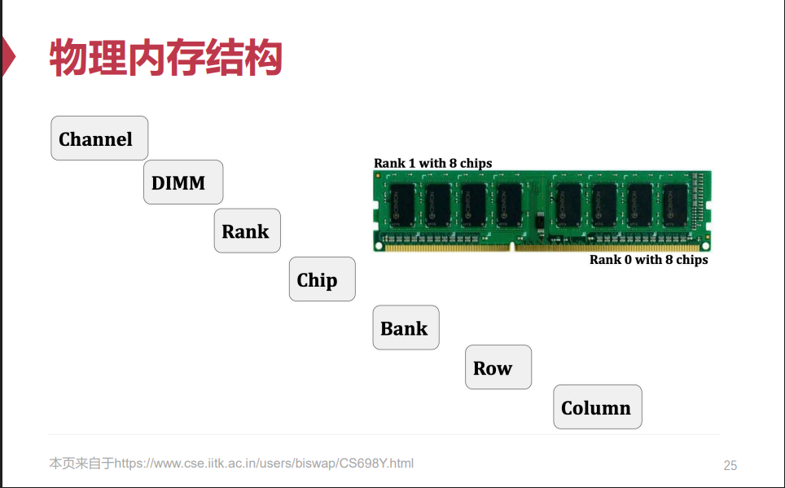

> 操作系统把物理内存抽象成“大数组”

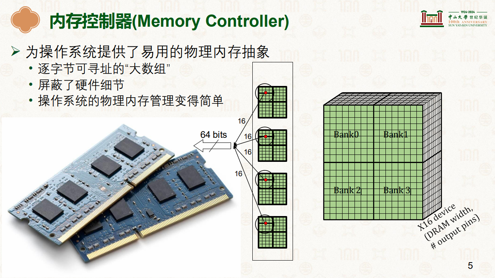

> 内存多通道

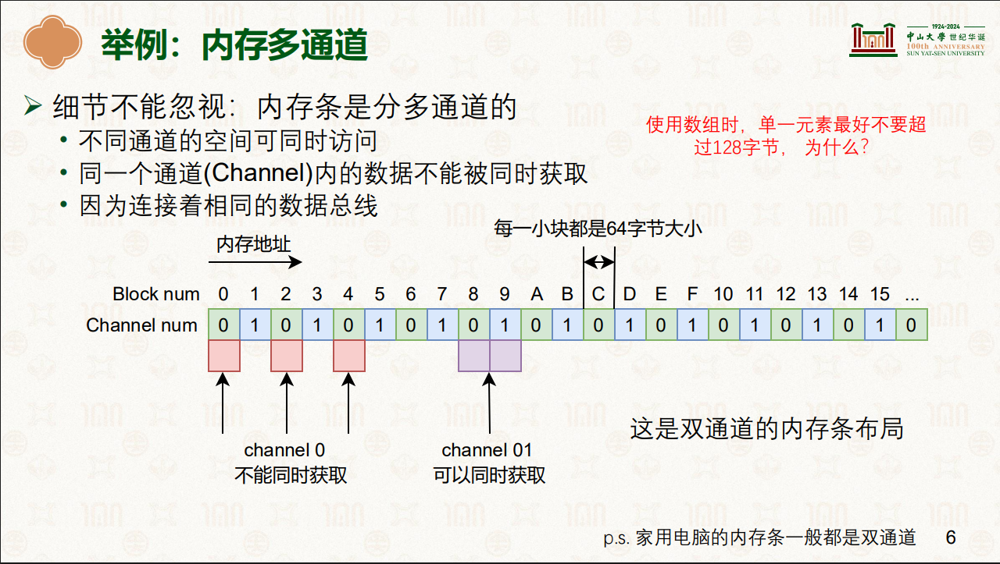

## 1.目标与评价维度

### 1.1 内存碎片

内存碎片(Memory Fragmentation)指的是无法被利用的内存，其直接导致内存资源利用率的下降。内存碎片又被分为外部碎片(External Fragmentation)和内部碎片(Internal Fragmentation)。

#### 1.1.1 外部碎片

外部碎片：在多次分配和回收之后产生。单个空白部分都小于分配请求的内存大小，但加起来足够。 

#### 1.1.2 内部碎片

内部碎片：因分配内存大于实际使用内存而导致。 

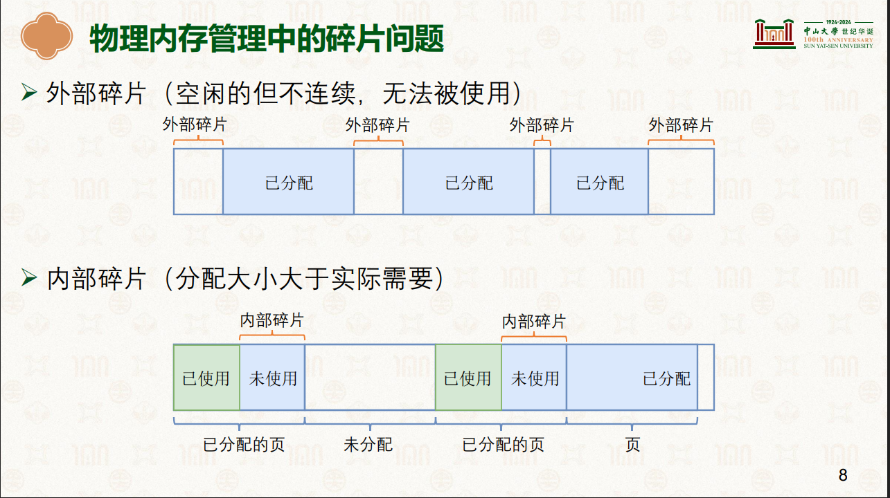

### 1.2 物理内存管理评价指标

操作系统的物理内存分配设计有两个重要的评价维度。

维度一，物理内存分配器要追求更高的内存资源利用率，即尽可能减少资源浪费；

维度二，物理内存分配器要追求优秀的性能，主要是尽可能降低分配延迟和节约CPU资源。通过精密的算法细致地解决碎片问题固然能够有效提高内存资源利用率，但却可能带来高昂的性能开销，比如增加分配器完成分配请求的时间，或者由于过多后台 处理而导致占用更多的CPU资源。

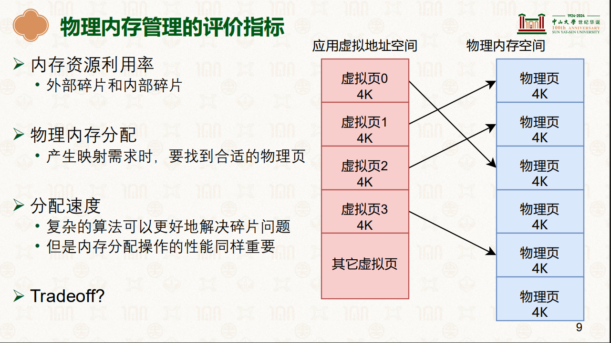

## 2.基于位图的连续物理页分配

### 2.1 内存池结构

一整个物理内存大数组分成两部分，一部分使用bitmap结构管理物理内存空间的分配情况，一部分为真实可用的物理内存空间。

位图(Bitmap)每一位对应一个物理页，若为0 则表明相应的物理页空闲，反之则为已分配；在分配时查找位图，找到为0的位，分配相应的物理页，并且把该位设置为1。

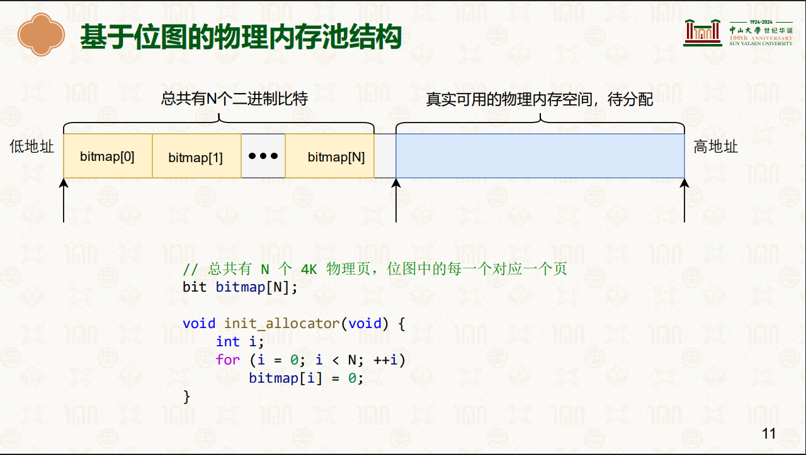

### 2.2 分配物理页

> 单页分配

遍历位图，找到一个bit位为0所对应的物理页，把bit位改为1，返回物理页地址。

> 连续物理页分配

分配n个连续的物理页只需要在位图中找到连续n位为0的位置，在位图中把相应的物理页标记为1,并返回其中起始物理页的地址

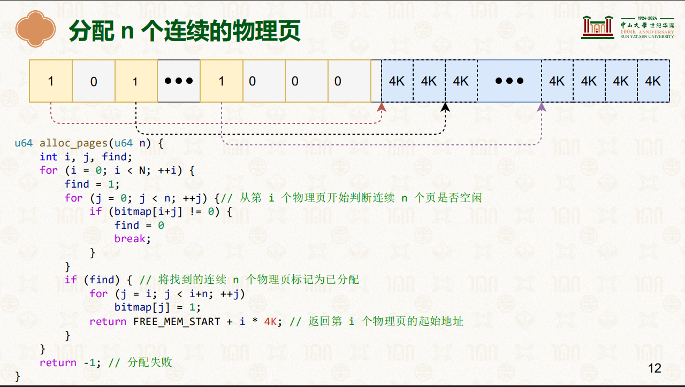

### 2.3 回收物理页

在位图中把要回收的物理页所对应bit位置0

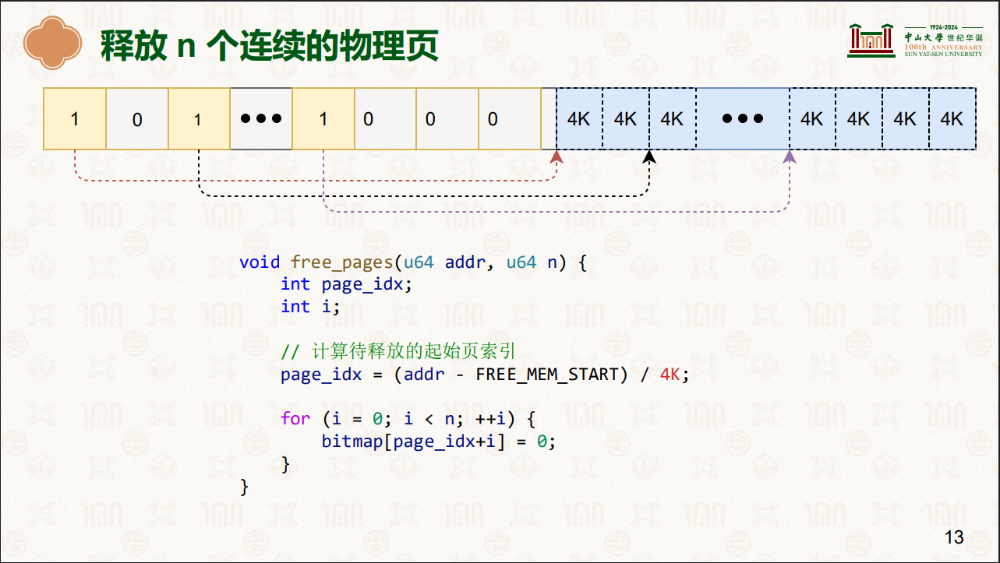

### 2.4 评价维度分析

Q&A：从分配速度+内存碎片维度分析

1.需要依次查询整个位图，所以分配速度慢

2.很容易产生外部碎片

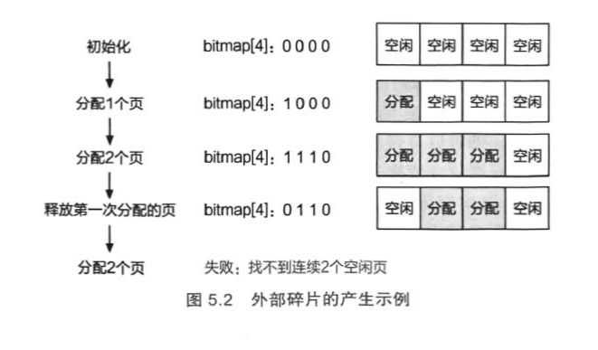

## 3.伙伴系统

### 3.1 以“块”为单位分配连续物理页的伙伴系统

伙伴系统(Buddy System)在现代操作系统中被广泛地用于分配连续的物理内存页，其基本思想是将物理内存划分成连续的块，以块作为基本单位进行分配。不同块的大小可以不同，每个块都由一个或多个连续的物理页组成，物理页的数量必须是2的n次幂(0≤n<预设最大值),其中预设最大值将决定能够分配的连续物理内存区域的最大值，一般由开发者根据实际需要指定。

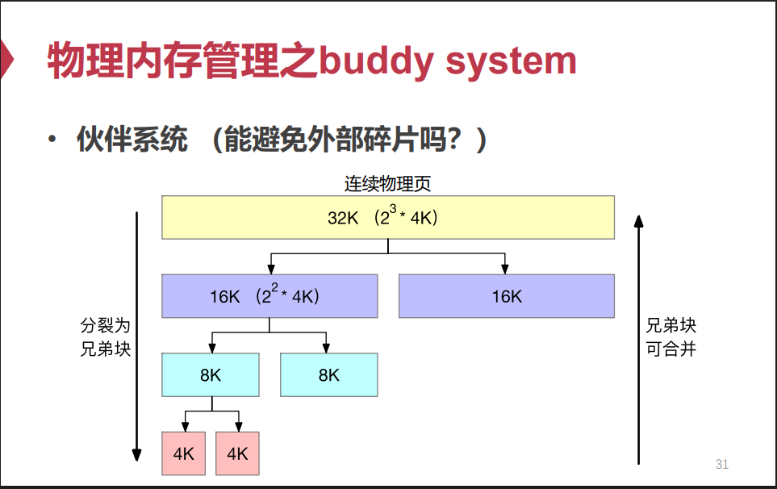

### 3.2 分配物理页

当一个请求需要分配m个物理页时，伙伴系统将寻找一个大小合适的块，该块包含2^n个物理页，且满足2^n-1<m<=2^n，在处理分配请求的过程中，大的块可以分裂成两半， 即两个小一号的块，这两个块互为伙伴。分裂得到的块可以继续分裂，直到得到一个大小合适的块去服务相应的分配请求。

Q&A：当连续物理页的最大预设值为3，需要分配7KB内存，如何处理？

```tex
								2^3个页 32KB
[-------- -------- -------- -------- -------- -------- -------- --------]
				2^2个页 16KB							2^2个页 16KB
[-------- -------- -------- --------][-------- -------- -------- --------]
	2^1个页 8KB			2^1个页 8KB
[-------- --------][-------- --------]
```

### 3.3 管理空闲页

Q&A：以上例子结束后，一个完整的2^3个页的物理块剩余的空闲块

```tex
				2^2个页 16KB
[-------- -------- -------- --------]
	2^1个页 8KB
[-------- --------]
```

Q&A：需要分配3KB内存，如何处理？

```tex
	2^1个页 8KB
[-------- --------]
  2^0个页		2^0个页
[--------][--------]
-------------------------------------
经过以上两次分配后剩余的空闲块
-------------------------------------
				2^2个页 16KB
[-------- -------- -------- --------]
  2^0个页
[--------]
```

> 使用链表数组管理空闲块

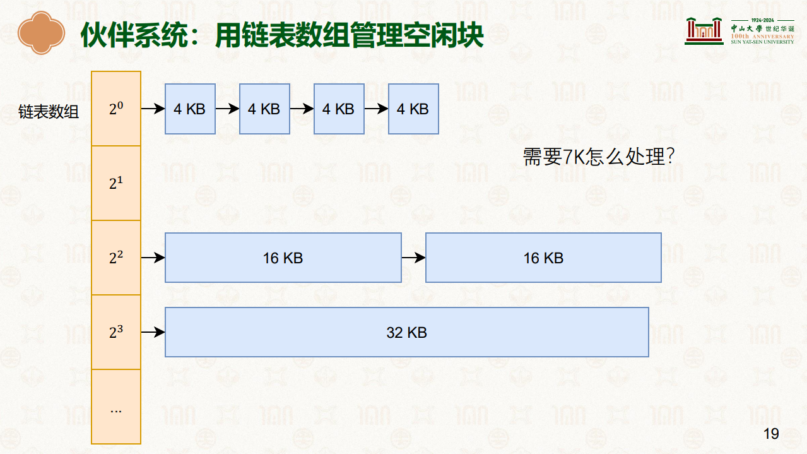

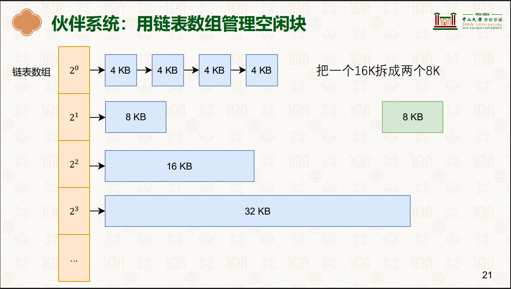

### 3.4 合并物理页

当接收到释放块的请求时，分配器首先找到待释放块的伙伴块。如果伙伴块处于非空闲状态，则将被释放的块直接插入对应大小的空闲链表中，即完成释放；如果伙伴块 处于空闲状态，则将两个块进行合并，当成一个完整的块释放，并重复该过程。

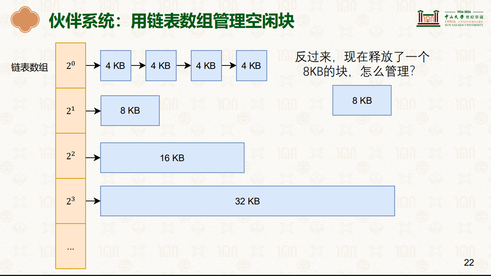

> 伙伴系统如何判断块与块之间是否是伙伴

互为伙伴的两个块，它们的内存地址仅有一位不同，且该位由块大小决定。所以在已知一个内存块地址的前提下，只需要翻转该地址中的一位就可以得到其伙伴块的地址，从而能够快速判断是否需要合并。

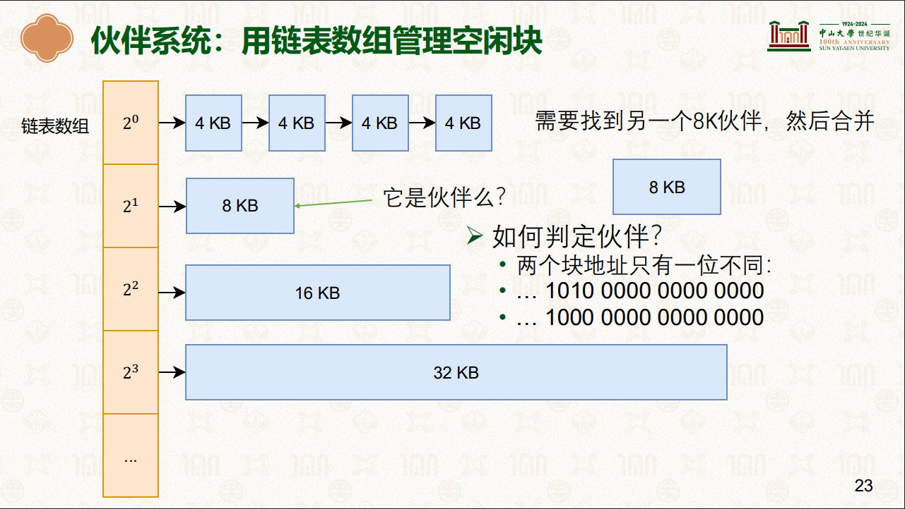

> 找到伙伴 做合并

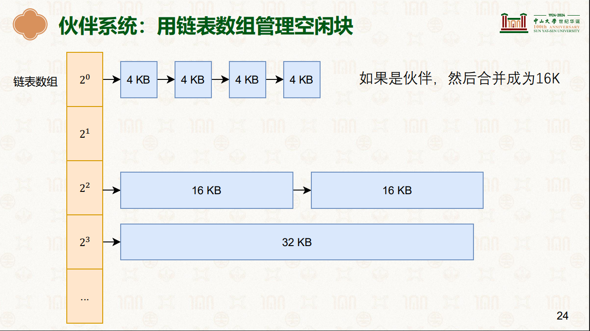

> 没找到伙伴

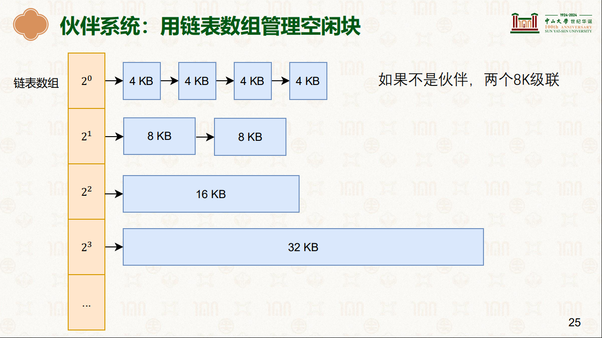

高效地找到伙伴块

互为伙伴的两个块的物理地址仅有一位不同 

```tex
 … 1010 0000 0000 0000 

 … 1000 0000 0000 0000 

 一个是0，另一个是1 

 块的大小决定是哪一位
```

### 3.5 评价维度分析

Q&A：从分配速度+内存碎片维度分析

1.高效分配&合并物理块，大部分情况下是O(1)时间复杂度，极端情况下时间复杂度是O(logn)

2.外部碎片：释放物理块后会进行合并，避免大量外部碎片产生

3.内部碎片：需要搭配SLAB分配器处理

## 4.SLAB分配器

### 4.1 内部碎片

伙伴系统最小的分配单位是一个物理页(4KB),但是大多数情况下，内核需要分配的内存大小通常是几十字节或几百字节，远远小于一个物理页的大小。如果仅使用伙伴系统进行内存分配，会出现严重的内部碎片问题，从而导致内存资源利用率降低。

操作系统开发人员设计了另外一套内存分配机制(SLAB分配器)，用于在操作系统中分配小内存。

### 4.2 SLAB历史


### 4.3 SLUB分配器

SLUB分配器是为了满足操作系统(频繁的)分配小对象的需求，其依赖于伙伴系统进行物理页的分配。简单来说，SLUB分配器做的事情是把从伙伴系统分配的大块内存进一步细分成小块内存进行管理。

#### 4.3.1 分配思想

一方面由于操作系统频繁分配的对象大小相对比较固定，另一方面为避免外部碎片问题，所以SLUB分配器只分配固定大小的内存块，块大小通常是2^n字节 (一般来说，3≤n<12)。


Q&A：如何理解对象大小固定，分配请求固定？

无论是操作系统的内核对象大小，还是通用的小内存请求，一般都是有固定size的，例如例如 32B, 64B, 128B, ..., 8KB, 16KB, 32KB 等

Q&A：基于以上这种情况，进行小块内存管理时，现实世界中是否有类似思想？

高架桥建造、定制预制菜、造车产线思想，对资源进行定制规格分类，生产管理。

#### 4.3.2 SLAB组成

一个 Slab 本质上是由伙伴系统分配的**一个或多个连续的物理页**（通常 1 页或少量页）构成的大内存块。Slab 内存块被**精细分割**成许多大小**完全相同**的小块，每个小块刚好容纳**一个特定类型的内核对象**（对于对象缓存）或**满足某个通用大小请求**（对于通用缓存）。


>  SLAB的状态

- **Full：** 所有对象都已分配。
- **Partial：** 部分对象已分配，部分空闲。
- **Empty：** 所有对象都空闲。

#### 4.3.3 各种规格资源池

精准匹配大小，为各个“特定类型的内核对象”+“通用大小内存申请请求”创建不同大小规格块的SLAB资源池，需要分配时找对应规格大小的资源池进行申请。


#### 4.3.4 资源池的两个指针

> current指针

current指针仅指向一个slab，所有的分配请求都将从该指针指向的 slab中获得空闲内存块。

> partial指针

partial指针指向由所有拥有空闲块的slab组成的链表。

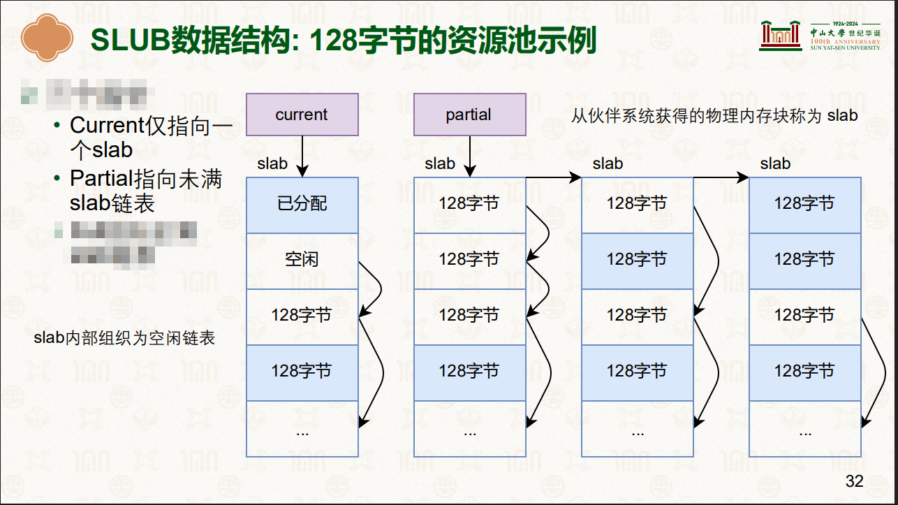

#### 4.3.5 分配请求

当SLUB分配器接收到一个分配请求时，首先定位到能满足请求大小且最接近的内存资源池，然后从current指针指向的slab中取出一个空闲的块返回。如果 current指针指向的slab在取出一个空闲块后，该slab不再拥有空闲块，即全部分配完，则从partial指针指向的链表中取出一个slab交给current指针。如果 partial指针指向的链表为空，那么SLUB分配器就会向伙伴系统申请分配新的物理内存作为新的slab。

这样的分配设计一方面有效避免了外部碎片，另一方面通常分配速 度很快(直接从current指针指向的slab中取出第一个空闲块即可)。通过合理地设 置不同大小的内存资源池，也能够尽可能减小内部碎片导致的开销。

#### 4.3.6 释放请求

当SLUB分配器接收到一个释放请求时，它将被释放的块放入相应slab的空闲链表中。如果该slab原本已经没有空闲块，即全部分配完，则将其重新移动到partial 指针指向的链表中；如果该slab变为所有内存块都是空闲的，即原来仅分配出去一块， 那么可以将其释放并还给伙伴系统。

至于如何找到释放块所属的slab,则可以通过在 slab头部加入元数据并且使得slab头部具有对齐属性等方式实现。

### 4.4 空闲块管理

#### 4.4.1 传统SLAB的位图

独立位图记录每个槽位状态（0=空闲, 1=已分配）。分配需扫描，释放O(1)，有空间开销。

#### 4.4.2 SLUB的嵌入式链表

利用空闲槽位自身的内存存储指向下一个空闲槽位的指针。`freelist` 头指针指向第一个空闲槽位。分配释放操作链表头，O(1)。

### 4.5 Per-CPU本地空闲列表

为了避免多个 CPU 核心同时访问 Cache 的全局 `slabs_partial` 链表造成的锁竞争。，每个 CPU 核心都有一个该 Cache 的 **本地空闲对象链表**。

- **分配：**
  - 优先从**当前 CPU 的本地链表**头部取一个空闲对象。**完全无锁！O(1) 极快！**
  - 如果本地链表空了，则从 Cache 的 `slabs_partial` 链表（或 `slabs_empty`）中**批量转移**一批空闲对象到本地链表（需要锁），然后再分配。
- **释放：**
  - 优先将对象放回**当前 CPU 的本地链表**头部。**完全无锁！O(1) 极快！**
  - 如果本地链表满了，则将其中的一部分对象**批量转移**回 Cache 的 `slabs_partial` 链表（需要锁）。
- **效果：** 绝大多数快速的分配/释放操作（尤其是小对象）都发生在无锁的 CPU 本地链表上，性能极高。只有本地缓存填充或清空时才需要触及全局结构（加锁）。

### 4.6 SLAB归还给伙伴系统

#### 4.6.1 SLAB元数据判断空闲

每个 Slab 都有一个元数据结构（传统 SLAB 是 `struct slab`，SLUB 复用 `struct page`），其中**明确记录当前 Slab 中空闲对象（槽位）的数量**（如 `free_objects` 或通过计算得出）

- **关键字段：**
  - `active_objects` / `inuse`：已分配的对象数量（SLUB 常用）。
  - `total_objects`：该 Slab 包含的对象槽位总数。
  - **空闲对象数 = `total_objects - active_objects`**。

- **状态标志 (State):** 根据空闲对象数，Slab 被标记为以下状态之一：
  - **`FULL`：** `active_objects == total_objects` (所有槽位已分配)。
  - **`PARTIAL`：** `0 < active_objects < total_objects` (部分分配，部分空闲)。
  - **`EMPTY`：** `active_objects == 0` (所有槽位空闲)。

#### 4.6.2 归还触发点

1. `Empty Slabs` 数量阈值
2. 内存紧张时的直接回收 (Reclaim)
3. 定时收缩 (Periodic Shrinking)
4. 销毁 Cache资源池

Q&A：为何不立即回收 EMPTY Slab？

1. **性能优化 (缓存暖身)：**
   - 一个刚刚变成 EMPTY 的 Slab，其内存可能还在 CPU Cache 中是“温热”的。
   - 如果很快又有新对象分配请求，复用这个 EMPTY Slab（只需将其状态改为 `PARTIAL` 并移回 `slabs_partial` 链表）**比从伙伴系统重新分配新页、初始化新 Slab 快得多**。
2. **减少碎片：** 频繁创建和销毁大小相同的 Slab 可能导致伙伴系统外部碎片。批量管理 EMPTY Slab 能减少这种操作频率。
3. **阈值控制：** 通过 `cpu_partial` 等阈值，系统在 **“保留一些温热 Slab 备用”** 和 **“释放闲置内存”** 之间取得平衡。