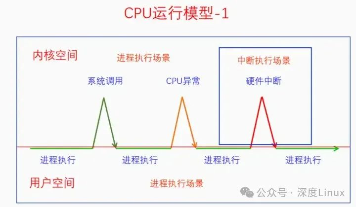
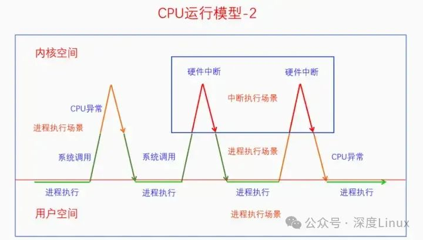
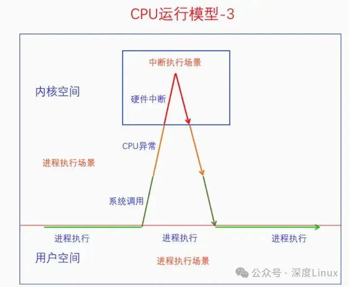
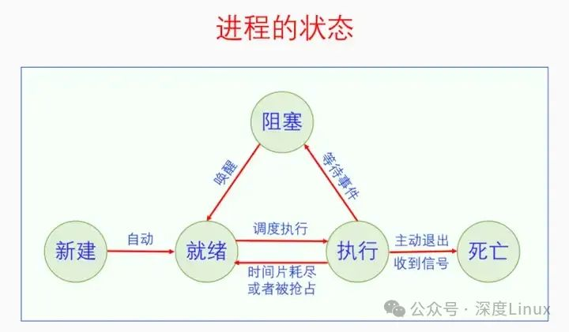
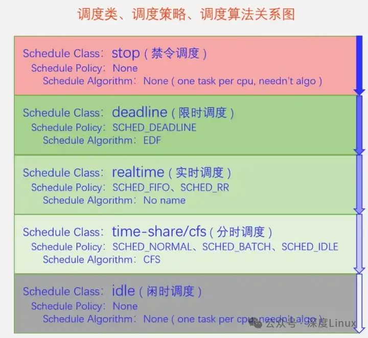
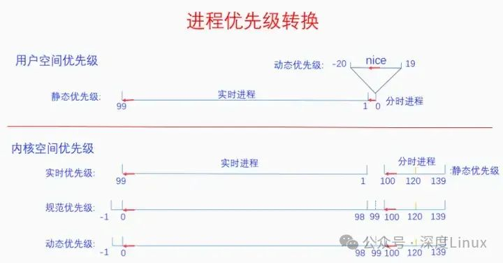

# Linux进程调度

## 1.理解“调度”

### 1.1.什么是调度

**“调度”是CPU资源管理器。**操作系统的作用之一就是管理资源，CPU是计算机最重要的资源，操作系统通过“调度”来管理这一资源。共享资源管理，有两种管理方式：空间分割管理、时间分割管理。CPU自身特性不具有空间分割相似性[^1]，只有时间分割相似性[^2]，所以对CPU进行时间分割管理，而对CPU进行时间分割管理的具体做法被称为**“进程调度”**。

>  进程是资源分配的基本单位，线程是执行单位，为何是**“进程调度”**而不是**“线程调度”**？

早期计算机系统没有多线程，进程就是线程，线程也是进程，所以此时进程调度调度的进程。当有了多线程后，线程变成了执行单位，进程不再是执行单位，进程调度调度的就是线程了。由于历史原因，习惯性还是叫成进程调度。

> 线程调度的两种方式

- 直接调度线程，不考虑它所属的进程，这些线程被称为一级线程，调度方式称为直接调度或一级调度
- 先调度进程，由进程内部调度线程，这些线程被称为二级线程，调度方式称为间接调度或二级调度

Linux实现的调度方式是直接调度，提高进程的并发性，充分利用CPU多核优势。二级调度的方式表面保证了进程调度的公平性，但是进程若计算量较大却不能通过多开线程来提高性能，不能充分利用CPU多核优势。反而一级调度实现能让计算量大的进程多开线程，计算量少的进程少开线程，变相公平。

### 1.2.为什么需要调度

> 远古时期的串行进程执行

最早时期计算机没有调度，程序只能排队一个接着一个地执行，下一个进程执行需要等待上一个进程的死亡。导致无法同时运行多个进程和当进程进入阻塞后CPU只能空转等待。

> 协作式多任务

当进程进入阻塞后或进程主动让出执行权，CPU可以去调度其他的进程。内核给进程提供系统调用`sched_yield`,作用是让进程主动让出CPU执行权；要求程序员在开发过程中，在程序中合适的地方尽可能地多加入该调用，主动让出CPU执行权，从而让各个进程间协作执行。

> 抢占式多任务

随着计算机使用者和程序员两角色分离，靠程序代码道德性约束的协作式多任务行不通，操作系统需要强制性多任务，也就是抢占式多任务，若一个进程运行的时间过长就会被强制性调度让出执行权。

协作式多任务和抢占式多任务，可相互独立也可在系统中同时存在，如果实现多任务，就需要调度。

### 1.3.为什么能调度

协作式多任务属于主动调度，抢占式多任务属于被动调度。

> 为什么能触发调度

主动调度是进程主动触发的，这是肯定能的。

对于被动调度，图灵机模型[^3]是做不到的，因为图灵机是一条线性一直往前走，进程在执行时若不主动退出，是不能跳到其他进程来执行的。被动调度能做到的关键是：引入**中断机制**，相当于在正常的执行流中插入一段代码，它能改变后面代码的执行走向；可以突破线性执行的限制，模拟被动调度。

有了**中断机制**，就可以创建一个定时器中断，以固定的时间间隔来触发中断，检测进程时候运行时间过长，如果过长就触发调度。

### 1.4.何时调度

####  1.4.1.主动调度

主动调度的**触发调度**和**执行调度**是**同步**的，**一体**的，触发即执行。主动调度发生的实际有**IO等待**、**加锁失败**等各种**阻塞操作**以及用户空间主动调用`sched_yield`

#### 1.4.2.被动调度

被动调度的**触发调度**和**执行调度**是**异步**的，**分离**的，触发调度后不会马上执行调度，先设置个需要调度的标记，然后在之后合适的时机检测该标记，如果被设置就进行调度。

>  触发调度时机

- 在定时器中断中发现当前进程超时（tick）
- 在唤醒进程时发现新进程需要抢占当前进程
- 在迁移进程时发现新进程需要抢占当前进程
- 在改变进程优先级时发现新进程需要抢占当前进程

第一个触发点是当前进程需要被抢占，它用来保证公平调度，防止进程霸占CPU的；后三个触发点是新进程需要抢占当前进程，是用来提高系统响应性的。

> 执行调度时机

1. 系统调用完成后即将返回用户空间
2. 中断完成后即将返回用户空间
3. 开启内核抢占的话，中断完成后即将返回内核（中断发生在禁止抢占临界区时会在临界区结束时执行调度）







### 1.5.如何调度

执行调度分两步，首先需要选择要执行的进程，接着切换进程。

#### 1.5.1选择进程

由**调度算法**选择要执行的进程，调度算法首先从*Runnable*状态的进程中进行选择，其次区分进程类型，比如普通进程和实时进程，会优先选择实时进程，在同一类型进程中还要有具体算法来决定最后选择哪个进程。在Linux系统中一共定义了[5类进程](#进程类型)，每一类都有一个具体的算法。类与类之间的关系是优先选择高类进程，只有当高类没有Runnable进程时才会去选择低类进程。

#### 1.5.2.切换进程

1. 保存当前进程上下文：将当前进程的**CPU寄存器状态**（如通用寄存器、程序计数器PC、栈指针SP等）保存到其`task_struct`的`thread_info`结构中
2. 切换内存地址空间：更新CR3寄存器（x86）或TTBR寄存器（ARM）以指向新进程的页表（`mm_struct`），切换虚拟地址空间[^5]。
3. 切换内核栈：将内核栈指针切换到新进程的内核栈
4. 更新当前进程指针：将全局变量`current`指向新进程的`task_struct`
5. 刷新TLB：清除旧进程的TLB[^4]缓存
6. 恢复新进程上下文
7. 处理信号与定时器
8. 执行上下文切换返回

### 1.6调度均衡

多CPU还需要考虑进度调度均衡问题，调度均衡分为个体均衡和总体均衡。个体均衡是从进程角度出发选择到一个相对清闲的CPU上运行；总体均衡是从CPU角度出发如何从别的CPU上拉取一些进程到自己的这里运行，使得所有CPU的工作量尽量平均。

个体均衡触发点：新进程刚创建时、进程要执行新程序时、进程被唤醒时

总体均衡触发点：CPU即将idle前会去找到最忙的CPU然后拉取一些任务过来；定时器中断的周期性检测，会检查是否所有的CPU都一样忙，如果忙闲差别太大就会进行进程迁移，使得所有CPU忙闲程度接近；在idle进程中如果CPU发现自己太忙而有的CPU在idle就会唤醒那个CPU进行负载均衡

## 2.进程调度框架

### 2.1.调度队列

进程状态切换



处于**就绪（Runnable）**状态的进程可以被调度到CPU上执行，处于就绪状态的进程可能不止一个，所以需要队列去存放所有就绪的进程。同时有多少个CPU，就需要有`NR_CPU`个运行队列

```c
//linux-src/kernel/sched/core.c
//rq结构存放进程
DEFINE_PER_CPU_SHARED_ALIGNED(struct rq, runqueues);

//linux-src/kernel/sched/sched.h
struct rq {
	raw_spinlock_t		__lock;
	unsigned int		nr_running;

	struct cfs_rq		cfs;
	struct rt_rq		rt;
	struct dl_rq		dl;

	struct task_struct __rcu	*curr;
	struct task_struct	*idle;
	struct task_struct	*stop;

	int			cpu;
	int			online;
};
```

内核定义的变量`runqueues`类型是`struct rq`，所有就绪状态进程会放入某个CPU的`rq`上，内核定义了五种调度类，不同调度类的进程会被放入不同的子队列中。其中`rq`包含了三个子队列：`cfs`、`rt`、`dl`；另外的两个调度类`idle`、`stop`每个CPU只能有一个进程，直接用指针变量`*idle`、`*stop`保存。

### 2.2.进程唤醒

进程是通过**唤醒**来放入到队列中的，其中唤醒包括新创建进程唤醒、阻塞唤醒。

> 新创建进程唤醒

在`fork`函数中会给进程选择到哪个CPU的`rq`上去，然后把进程添加到对应的运行队列上，最后再检查是否要抢占，需要就触发抢占。

> 阻塞唤醒

唤醒阻塞进程，先检测被唤醒的进程时候是当前进程，是直接`go out`；再检测进程的状态`state`是否符合，不符合不唤醒；再检查进程是否已经是唤醒状态，如果是则无需唤醒；最后决定需要把进程放到哪个CPU的运行队列上进行，把进程放到目标运行队列上去。

### <a id=进程类型>2.3.调度类&调度策略&调度算法</a>

内核中有调度类、调度策略和调度算法的概念。调度类代表的时进程对调度器的需求（主要是调度紧迫性需求）；调度策略是调度类的子类，是对调度类的细分，是同一个调度需求下的细微区别；调度算法是调度类的实现，一个调度类一个调度算法。同一个调度类的调度策略有强相似性，在同一个算法实现中，对于它们不同的部分，算法再去进行区分。



Linux中一共有5种调度类，分别是stop（禁令调度）、deadline（限时调度）、realtime（实时调度）、time-share/cfs（分时调度）和idle（闲时调度）。紧迫性从上到下依次降低。其中禁令调度和闲时调度是仅用于内核中的特殊进程，没有调度策略，在启动时一个CPU对应一个相应进程设置好。其余三种调度都可以用于用户空间，在有高类进程可运行的情况下，不会去调度低类进程（为防止实时进程饿死普通进程，内核提供一个配置参数，配置实时进程最大占用CPU时间百分比）。

> 禁令调度

禁令调度类是内核用来执行一些特别紧急的事物所使用的。禁令调度类的进程是内核在启动时就创建好的，一个CPU一个进程，名字叫做[migration/n]，n是CPU_ID，之后就不能再创建此类进程了。

> 限时调度

限时调度类属于硬实时，适用于对调度时间有明确要求的进程。它只有一个调度策略，限时调度策略。一个进程必须通过系统调用才能把自己设置为限时调度策略，并且还要提供三个参数：运行周期、运行时间和截止时间。运行周期是说这个进程在多长时间内想要运行一次，运行时间是说这个进程每次想要运行多长时间，截止时间是说这个进程每次运行结束不能晚于什么时间。

> 实时调度

实时调度类属于软实时，适用于那些只要可运行就希望立马能执行的进程，比如音视频的解码进程。实时调度类又分为两个调度策略，`SCHED_FIFO`和`SCHED_RR`。实时调度类的内部逻辑是让实时优先级大的进程先运行，只要有实时优先级大的进程可运行，就不会去调度实时优先级小的进程。

`SCHED_FIFO`策略:该策略进程会占用了CPU会一直执行到停止，不会让出CPU执行权

`SCHED_RR`策略：该策略进程在运行了一定的时间片后会主动让给同类优先级的实时进程

> 分时调度

分时调度类是给广大的普通进程来用的，大家共同分享CPU。根据优先级的不同，可能有的进程分的多有的进程分的少，但是不会出现一个进程霸占CPU的情况。分时调度类下面有三个调度策略：`SCHED_NORMAL`、`SCHED_BATCH`和`SCHED_IDLE`。它们的基本思想都是分时，

`SCHED_BATCH`进程希望减少调度次数，每次调度能执行的时间长一点

`SCHED_IDLE`是优先级特别低的进程，其分到的CPU时间的比例非常低，但是也总是能保证分到。

分时调度类现在的算法叫做`CFS`(完全公平调度)，所以分时调度类也叫做公平调度类。

> 闲时调度

闲时调度类是给内核用的，当CPU没有其它进程可以执行的时候就会运行闲时调度类的进程。此类进程是在内核启动时就创建好的，一个CPU一个进程，此后就不能再创建此类进程了。闲时调度类的进程也叫做idle进程，它在内核中有些特殊的用途，比如`CPUIdle`的实现就和idle进程密切相关

### 2.4.进程优先级

五种调度类中，禁令调度类和闲时调度类在内核中使用且一个CPU只有对应的一个进程，用不到优先级；限时调度类用的是进程设置的三个调度参数作为调度依据，也用不到优先级。只有实时调度类和分时调度类会用到进程优先级。

#### 2.4.1.进程优先级转换

实时进程和普通进程的优先级是由好几个数值体系和变换规则计算得来。

>  实时调度类优先级

静态优先级范围是1-99,99最大

> 分时调度类优先级

静态优先级必须设置为0，动态优先级也就是nice需要通过nice接口来设置。

> 进程的优先级字段

```c
//linux-src/include/linux/sched.h
struct task_struct {
    //动态优先级 默认等于normal_prio
	int				prio;
    //实时调度类的静态优先级
	int				static_prio;
    //rt_priority和static_prio一起转化为normal_prio(规范优先级)
	int				normal_prio;
    //分时进程的用户空间的动态优先级并做了转换
	unsigned int	rt_priority;
}
```

> 优先级转换

实时进程和普通进程会通过静态设置+数据转换，计算出优先级数值，最后统一到优先级数轴中。



在用户空间的时候，实时进程和普通进程(分时进程)共享同一个优先级数轴，叫静态优先级，范围是0-99，值越大优先级越高，实时进程占用1-99，普通进程占用0。普通进程自己又新开了一个数轴，叫动态优先级，也叫nice值，范围是 -20 - 19，值越低优先级越高。

```c
//---------------用户空间优先级表示---------------
/*
实时进程：99~0，数值越大优先级越高
普通进程：-20~19 数值越小优先级越低
*/
```

到了内核空间的时候，实时进程有一个实时优先级，直接复制用户空间的静态优先级，普通进程有一个静态优先级，它是用户空间的nice值转换过来的，转换规则是nice+120。

```c
//---------------内核空间静态优先级表示---------------
/*
实时进程：99~0，数值越大优先级越高
普通进程：-20+120~19+120 -> 100~139 数值越小优先级越低
*/
```

然后内核又定义了规范优先级，把它们都统一到同一个数轴上来。普通进程的规范优先级是直接复制其静态优先级，实时进程的规范优先级等于它的实时优先级减去99。在规范优先级的数轴上，所有进程都可以直接比较优先级了，值越小优先级越大。

```c
//---------------内核空间规范优先级表示---------------
/*
实时进程：99-99~0-99 -> 0~-99 数值越小优先级越高
普通进程：-20+120~19+120 -> 100~139 数值越小优先级越低
		实时进程					普通进程
|0--------------------|99|100-------120-------139|
*/
```

最后是动态优先级，对进程所有的处理都以动态优先级为准，动态优先级默认等于其规范优先级。以前的时候调度算法会去调整进程的动态优先级，现在不会再调了。现在只有使用了优先级继承锁的时候才会去调整进程的动态优先级。

#### 2.4.2.进程调度时间分配

实时进程根据`SCHED_FIFO`和`SCHED_RR`策略调度；普通进程根据内核版本的优化有多种调度算法。

>  2.4内核版本前的**O(n) 调度器**

根据静态优先级来计算初始时间片。如果静态优先级小于 120，时间片为` (140 - static_prio) * 20`；如果静态优先级大于等于 120，时间片为 `(140 - static_prio) * 5`。

每次调度时遍历整个进程队列（时间复杂度 **O(n)**），计算每个进程的 **goodness 值**，选择值最高的进程执行。

Linux 用函数 goodness () 来衡量一个处于可运行状态的进程值得运行的程度，该函数会对权重进行微调，以缩小进程实际使用时间片的差异。

> 2.6.3内核版本后的**CFS 调度器**

对普通进程（分时调度类，即 `SCHED_NORMAL` 或 `SCHED_OTHER`）的 CPU 时间分配并非直接基于优先级，而是通过 **虚拟运行时间（vruntime）** 和 **权重（weight）** 的机制实现按优先级的比例分配。

CFS 的核心是跟踪每个进程的 `vruntime`，每次调度选择最小`vruntime`的进程执行并根据优先级去决定进程`vruntime`的增长趋势从而实现不同优先级进程分配不同大小的CPU时间片，并且保证进程执行的“公平性”和解决饥饿进程问题。


[^1]: 将物理资源（如硬件单元、内存区域）划分为多个独立部分，每个部分**同时处理不同任务**。
[^2]:同一物理资源在不同时间片段内**轮流服务于不同任务**，通过快速切换实现“伪并行”。
[^3]:标准图灵机的设计本质是**单线程、无中断的线性执行模型**，具有顺序性，无并发性，被动型缺陷
[^4]:**TLB（Translation Lookaside Buffer）** 是计算机系统中用于加速 **虚拟地址到物理地址转换** 的关键硬件组件，属于 CPU 内存管理单元（MMU）的一部分。存储最近使用的 **虚拟页号（VPN）→ 物理页框号（PFN）** 的映射关系，避免每次地址转换都需访问内存中的页表。
[^5]:虚拟内存**虚拟内存**是计算机系统管理内存的核心机制，通过**分页**技术为每个进程提供独立、连续的虚拟地址空间，映射到物理内存或磁盘