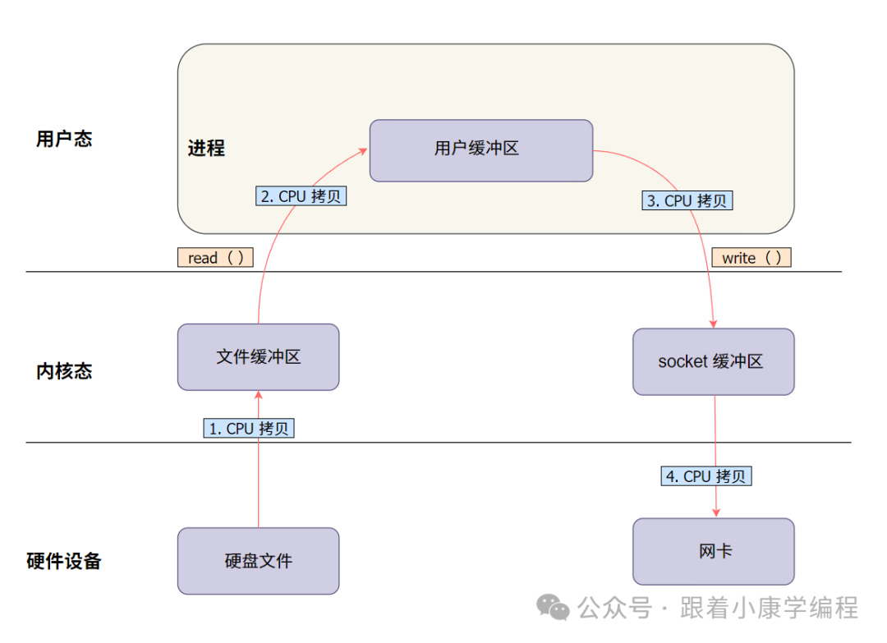
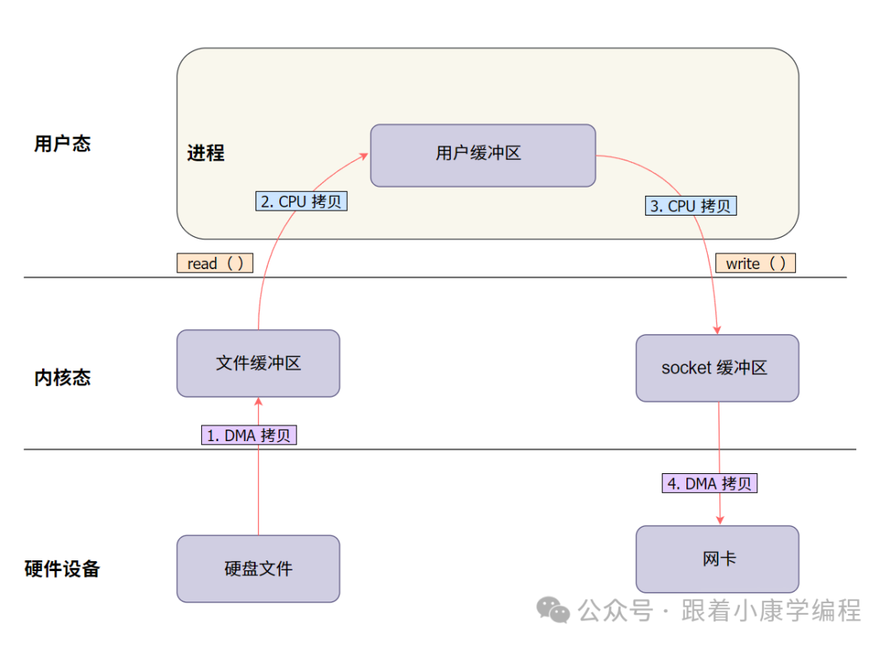
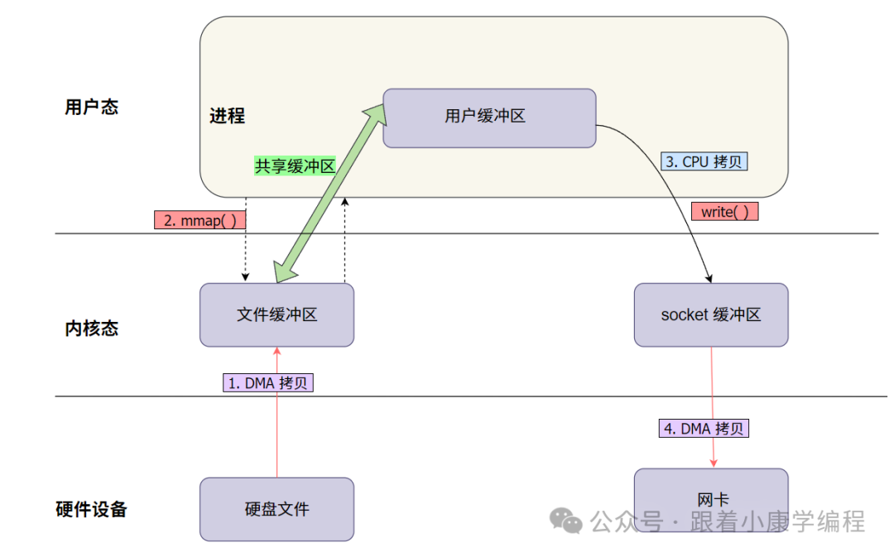
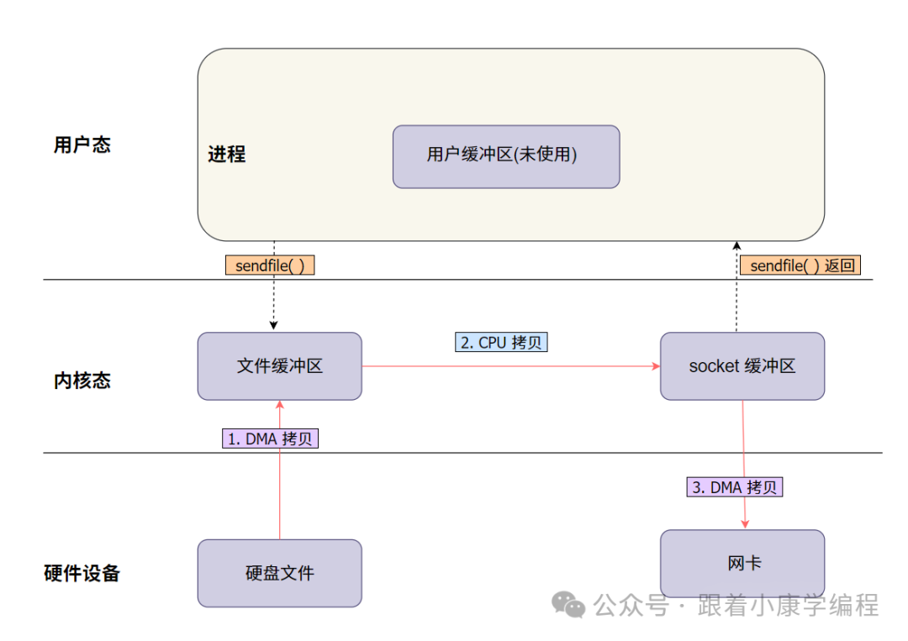
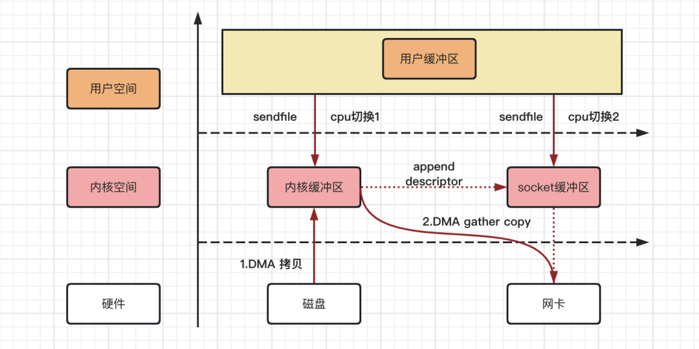
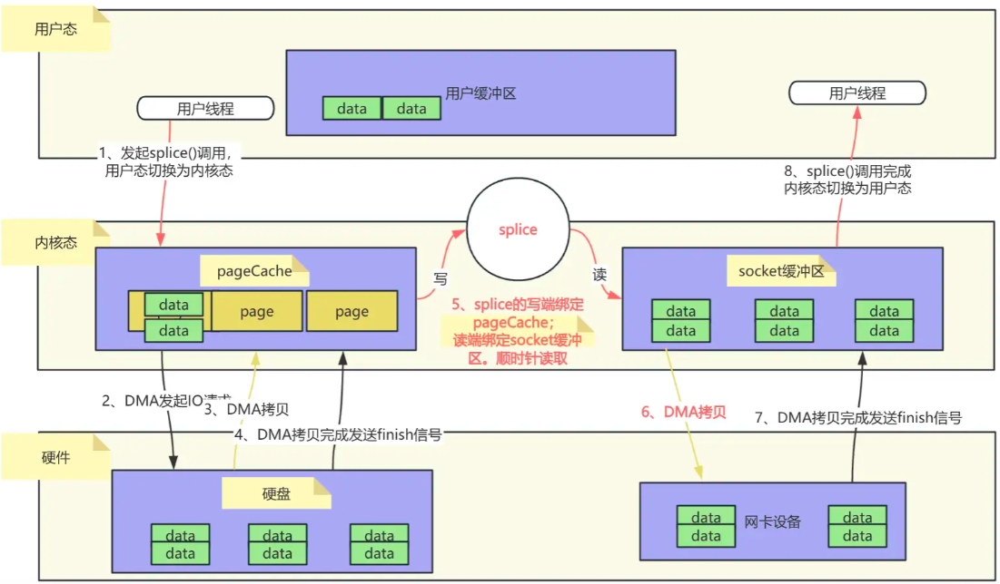
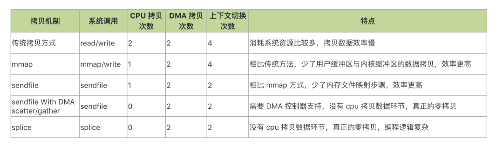

# Linux 零拷贝技术

传统数据传输涉及多次在用户空间与内核空间之间的数据拷贝以及频繁的上下文切换，会消耗大量CPU资源，降低系统性能，零拷贝技术正是为解决该问题而生。

零拷贝技术是指计算机在数据传输过程中，减少甚至完全避免不必要的数据拷贝操作，让数据直接在内核空间进行传输，避免在用户空间和内核空间之间多次来回拷贝，从而提高数据传输效率。

## 1.传统拷贝

在传统的数据传输方式中，当我们需要把一个大文件从硬盘读取后发送到网络上，需要涉及多个步骤并占用大量CPU资源：

### 1.1 一个典型的文件传输过程（没有 DMA 技术）：

假设我们要将一个大文件从硬盘读取后发送到网络。以下是传统拷贝方式的详细步骤：

1. **读取数据到内核缓冲区**：使用 `read()` 系统调用，数据从硬盘读取到内核缓冲区。此时，CPU 需要协调和执行相关指令来完成这一步。
2. **拷贝数据到用户缓冲区**：数据从内核缓冲区被拷贝到用户空间的缓冲区。这一步由 `read()` 调用触发，CPU 完全负责这次数据拷贝。
3. **写入数据到内核缓冲区**：通过 `write()` 系统调用，数据从用户缓冲区被再次拷贝回内核缓冲区。CPU 再次介入并负责数据拷贝。
4. **传输数据到网卡**：最终，内核缓冲区的数据被传输到网卡，发送到网络。如果没有 DMA 技术，CPU 需要拷贝数据至网卡。

### 1.2 数据传输的“四次拷贝”

在这个过程中，数据在系统中经历了四次拷贝：

- **硬盘 -> 内核缓冲区**（CPU 参与，负责数据读取和传输）
- **内核缓冲区 -> 用户缓冲区**（`read()` 调用触发，CPU 负责拷贝）
- **用户缓冲区 -> 内核缓冲区**（`write()` 调用触发，CPU 负责拷贝）
- **内核缓冲区 -> 网卡**（最终发送数据，CPU 参与传输）

### 1.3 上下文切换

在这个过程中，CPU 切换次数包括4 次用户态和内核态的切换：

- `read()`系统调用，用户空间--》内核空间；内核空间--》用户空间
- `write()`系统调用，用户空间--》内核空间；内核空间--》用户空间

### 1.4 性能瓶颈分析

这种传统拷贝方式的问题显而易见：

- **CPU 资源占用高**：每次 `read()` 和 `write()` 调用都需要 CPU 进行多次数据拷贝，严重占用 CPU 资源，影响其他任务的执行。
- **内存占用**：当数据量较大时，内存使用量明显增加，可能导致系统性能下降。
- **上下文切换开销**：每次 `read()` 和 `write()` 调用涉及用户态和内核态的切换，加重了 CPU 的负担。

**整个过程产生了CPU参与的四次数据拷贝+CPU切换次数包括4次用户态和内核态的切换**

这些问题在处理大文件或高频率传输时尤为明显，CPU 被迫充当“搬运工”，性能因此受到严重限制。那么， 有没有一种方法能够减少 CPU 的“搬运”工作？此时，`DMA`（Direct Memory Access，直接内存访问）技术登场了。

## 2.DMA：零拷贝的前奏

**DMA（Direct Memory Access，直接内存访问）**：一种让硬件设备无需通过CPU中转直接访问计算机内存的技术，`DMA`控制器接管总线，完成外设与内存之间的数据搬运，传输完成后向CPU发起硬中断信号。有了`DMA`技术后，CPU就不需要在传送过程中逐字节处理数据了，大大减少了CPU的工作量。

### 2.1 DMA 如何帮 CPU？

- **硬盘到内核缓冲区**：由 `DMA` 完成，CPU 只需要下指令，`DMA` 就自动将数据拷贝至内核缓冲区。
- **内核缓冲区到网卡**：`DMA` 也能处理这部分，把数据直接送到网卡，CPU 只需监督整体流程。

有了`DMA`参与后的文件传送流程图：

**说明**：

- `DMA`负责硬盘到内核缓冲区和内核到网卡的传输。
- **CPU** 仍需处理内核和用户缓冲区之间的数据传输。

### 2.2 哪些步骤仍需 CPU 参与？

虽然 `DMA` 能帮 CPU 分担一些任务，但它并不能全权代理所有数据拷贝工作。**CPU 还是得负责以下两件事**：

- **内核缓冲区到用户缓冲区**：数据需要被 CPU 拷贝到用户空间供程序使用。
- **用户缓冲区回到内核缓冲区**：程序处理完数据后，CPU 还得把数据拷回内核，准备进行后续传输。

### 2.3 性能瓶颈分析

从上述过程可以看出总共经历了4 次拷贝次数、4 次上下文切换次数。

**其中数据拷贝次数包括2 次 DMA 拷贝，2 次 CPU 拷贝；而CPU 切换次数包括4 次用户态和内核态的切换。**

`DMA `确实减轻了 CPU 在数据传输中的负担，让数据从硬盘传输到内核缓冲区和内核缓冲区到网卡时几乎无需 CPU 的参与。然而，`DMA `无法彻底解决数据在内核和用户空间之间的拷贝问题。CPU 依然需要进行两次数据搬运，特别是在高并发和大文件传输场景下，这个限制变得尤为突出。

为了进一步减少 CPU 的参与，提升传输效率，Linux 推出了 **零拷贝** 技术。这项技术的核心目标是：**让数据在内核空间内直接流转，避免在用户空间的冗余拷贝，从而最大限度减少 CPU 的内存拷贝操作，提高系统性能。**

## 3.零拷贝（Zero-Copy）技术

### 3.1 定义与原理

零拷贝技术并非指完全没有数据拷贝的过程，而是**减少用户态和内核态的切换次数以及CPU拷贝的次数**。它通常通过直接内存访问（DMA）技术和内存映射（如mmap）等机制来实现。

1. DMA技术：DMA允许硬件设备（如网卡、硬盘控制器等）直接访问内存，而无需CPU的介入。在数据传输过程中，DMA控制器负责将数据从源地址传输到目标地址，从而减少了CPU的拷贝工作。
2. 内存映射：内存映射技术将文件或设备的内容映射到进程的地址空间中，使得进程可以直接访问这些数据，而无需通过传统的读/写系统调用。这种方式减少了数据在用户空间和内核空间之间的拷贝次数。

零拷贝技术广泛应用于网络传输、文件读写等场景，以提高数据传输效率和系统性能。

### 3.2 实现方式

零拷贝技术的实现方式有多种，包括但不限于以下三种：

- `mmap`内存映射：通过内存映射将文件或设备的内容映射到进程的地址空间中，使得进程可以直接访问这些数据。这种方式减少了数据在用户空间和内核空间之间的拷贝次数，并提高了数据访问速度。
- `sendFile`系统调用：允许在内核空间中直接传输数据，避免了数据在用户空间和内核空间之间的额外拷贝。
- `splice`系统调用：用于在管道（pipe）或套接字（socket）之间高效地传输数据。它允许将一个文件描述符的数据直接传输到另一个文件描述符，而无需经过用户空间的拷贝。

#### 3.2.1 `mmap `+` write`：**映射式零拷贝**

`mmap`是Linux内核提供的一种内存映射文件的方式，它利用了**虚拟内存**的特性，可以将一个进程的虚拟地址映射到文件物理内存地址，建立映射关系后，进程可以直接通过访问虚拟内存地址来读写文件内容，实现零拷贝。

> `mmap`+`write`工作流程：

- 使用 `mmap` 系统调用将文件映射到进程的虚拟地址空间中，这样数据就可以直接在内核空间和用户空间共享，而不需要额外的拷贝操作。
- 使用 `write` 系统调用将映射的内存区域直接写入到目标文件描述符中（比如网络 socket），完成数据传输。

> `mmap`+`write`图解

**一共发生了2 次 `DMA `拷贝，1 次 CPU 拷贝，4 次用户态和内核态的切换。相比于传统的IO流程少了1次CPU拷贝。**

>  `mmap`零拷贝总结

通过调用`mmap`而不是`read`，我们已经将内核需要执行的复制操作减半。当有大量数据要进行传输是，这将有相当良好的效果。然而，性能的改进需要付出代价的;是用`mmap`与`write`这种组合方法，存在着一些隐藏的陷阱。例如，考虑一下在内存中对文件进行映射后调用`write`，与此同时另外一个进程将同一文件截断的情形。此时write系统调用会被进程接收到的`SIGBUS`信号中断，因为当前进程访问了非法内存地址。对`SIGBUS`信号的默认处理是杀死当前进程并生成dump core文件——而这对于网络服务器程序而言不是最期望的操作。

> 应用场景

- Netty：在处理文件传输等场景时，Netty可以结合`mmap + write`技术。通过`FileRegion`接口，Netty可以利用`mmap`将文件映射到内存中，然后使用`write`操作将数据高效地发送到网络。这种方式避免了传统的多次数据拷贝，提高了文件传输的性能。
- Kafka：Kafka在处理消息存储和传输时，会使用`mmap + write`技术。Kafka的日志文件采用顺序读写的方式，通过`mmap`将日志文件映射到内存中，生产者生产的消息可以直接追加到映射的内存区域，然后通过`write`操作将数据持久化到磁盘。这样可以减少数据在用户空间和内核空间之间的拷贝，提高消息的写入性能。

- Redis：在进行RDB（Redis Database）持久化时，Redis可能会使用`mmap + write`技术。RDB持久化是将Redis在内存中的数据快照保存到磁盘文件中。通过`mmap`将磁盘文件映射到内存，Redis可以直接将内存中的数据写入到映射的内存区域，然后通过`write`操作将数据持久化到磁盘，减少了数据拷贝的开销。

#### 3.2.2 `sendFile`系统调用

`sendfile` 是最早在 Linux 中引入的零拷贝方式，专为文件传输设计。通过`sendfile`系统调用，让内核直接把磁盘文件数据读取到内核缓冲区，再将其拷贝到套接字缓冲区，避免了数据在用户空间和内核空间之间的拷贝。

> `sendFile`的工作流程

1. DMA（直接内存访问）直接将文件数据加载到内核缓冲区。
2. 数据从内核缓冲区直接进入网络协议栈中的 socket 内核缓冲区。
3. 数据通过网络协议栈处理后，通过网卡直接发往网络。

通过 `sendfile`，整个传输过程 CPU 只需要一次数据拷贝，减少了 CPU 的使用。

> `sendFile`图解

`sendfile` 图解说明：

1. **从硬盘读取数据**：文件数据通过 `DMA `从硬盘读取，直接加载到内核缓冲区，这个过程不需要 CPU 的参与。
2. **拷贝数据至网络协议栈的 socket 缓冲区**：数据不进入用户空间，而是从内核缓冲区直接进入网络协议栈中的 socket 缓冲区，在这里经过必要的协议处理（如 TCP/IP 封装）。
3. **数据通过网卡发送**：数据最终通过网卡直接发往网络。

**整个过程中只发生了2次上下文切换，1次CPU拷贝；相比`mmap+write()`又节省了2次上下文切换。同时内核缓冲区和用户缓冲区也无需建立内存映射，节省了内存上的占用开销。**

> `sendFile`系统调用+`DMA` scatter/gather

单纯的`sendfile`

- 拷贝过程：`sendfile`系统调用在Linux内核中实现了将磁盘数据通过`DMA`拷贝到内核态Buffer后，再通过CPU拷贝（或少量参与）和`DMA`拷贝到网卡设备的过程。尽管`sendfile`已经减少了CPU的拷贝负担，但在数据从内核Buffer传输到socket Buffer的过程中，CPU仍然需要参与一定的拷贝或调度工作。
- 拷贝次数：通常包括2次`DMA`拷贝和1次CPU拷贝（尽管在某些实现中CPU拷贝可能被优化至最低程度），以及必要的上下文切换。

`sendfile`+`DMA` scatter/gather

- 拷贝过程：在Linux 2.4内核版本中引入的`SG-DMA`技术，对`DMA`拷贝加入了scatter/gather操作。这意味着`DMA`控制器可以直接从内核空间缓冲区中读取数据并传输到网卡，无需CPU的进一步拷贝。
- 拷贝次数：实现了真正的零拷贝，即全程没有CPU参与数据拷贝。数据拷贝完全由`DMA`控制器完成，包括2次`DMA`拷贝和0次CPU拷贝。

**整个过程中只发生了2次上下文切换,两次`DMA`拷贝；相比单纯的`sendfile`又节省了1次CPU拷贝。**

> `sendFile`总结

`sendfile `可以让数据传输更加高效，减少 CPU 的干预，特别适合简单的大文件传输场景。然而，如果遇到更复杂的传输需求，比如要在多个不同类型的文件描述符之间移动数据，`splice`则提供了一种更加灵活的方法。接下来我们来看看`splice`是如何实现这一点的。

> 应用场景

Netty：Netty 在进行文件传输时，可结合 `sendfile` 实现零拷贝。通过 Java 的 `FileChannel` 的 `transferTo` 方法（底层依赖于操作系统的 `sendfile` 机制），将文件内容直接从文件通道传输到网络通道，减少数据拷贝开销，提升传输性能。

#### 3.2.3 `splice`系统调用

`splice`是 Linux 内核提供的一种零拷贝机制，用于在两个文件描述符之间高效地移动数据，避免了数据在用户空间和内核空间之间的多次拷贝，从而提升系统性能。

`splice` 实现零拷贝的核心在于它允许数据直接在内核空间的不同缓冲区之间进行移动，而无需将数据拷贝到用户空间。它利用管道作为数据传输的中间媒介，通过在内核中操作管道缓冲区，将数据从一个文件描述符对应的缓冲区移动到另一个文件描述符对应的缓冲区。

> `splice`的工作流程

1. 准备阶段：在使用splice之前，通常需要创建一个管道（pipe）作为数据的中转站。这个管道并不会真正存储数据，而是作为一个通道来传递数据指针或元数据。
2. 数据拷贝阶段：使用splice系统调用，将源文件（如磁盘文件）的数据直接“拷贝”到管道的写端。这里的“拷贝”实际上是将文件的页缓存（Page Cache）与管道的环形缓冲区（Ring Buffer）进行绑定。接着，再次使用splice系统调用，将管道读端的数据“拷贝”到目标文件（如网络套接字）中，这一步CPU并没有参与数据拷贝，因为它只是将管道的环形缓冲区与目标文件的缓冲区进行绑定，并传递数据指针。
3. 数据传输完成：通过上述两次splice操作，数据就完成了从源文件到目标文件的传输，而无需经过用户态的拷贝。这大大提高了数据传输的效率。

> `splice`图解

**这个过程中全程没有CPU参与数据拷贝。数据拷贝完全由`DMA`控制器完成，包括2次`DMA`拷贝和0次CPU拷贝。**

> `sendfile`与`splice`的区别

- `sendfile`：直接将文件中的数据从内核缓冲区传输到 socket 缓冲区，适合文件到网络的传输。适合需要简单高效的文件到网络的传输场景。
- `splice`：更灵活，可以在任意文件描述符之间进行数据传输，包括文件、管道、socket 等。因此`splice`可以在文件、管道和 socket 之间实现更复杂的数据流转。

> `splice`应用场景

- CDN：边缘节点之间的数据同步。在分发大文件（如视频、软件包）时，通过 `splice` 在内核空间直接转发数据，减少用户态参与。
- rsync：高效文件同步。在传输文件差异部分时，使用 `splice` 直接操作文件描述符，避免多次数据拷贝。

- FFmpeg：一套强大的开源音视频处理工具集，广泛应用于音视频的录制、转码、流媒体传输等领域。在进行流媒体数据的实时传输时，FFmpeg可以使用`splice`技术。例如，将摄像头采集的视频数据直接传输到网络进行直播，或者将本地的音视频文件流式传输到客户端，`splice`能提高数据传输的效率，减少延迟，保证播放的流畅性。

## 4.各种零拷贝技术对比

