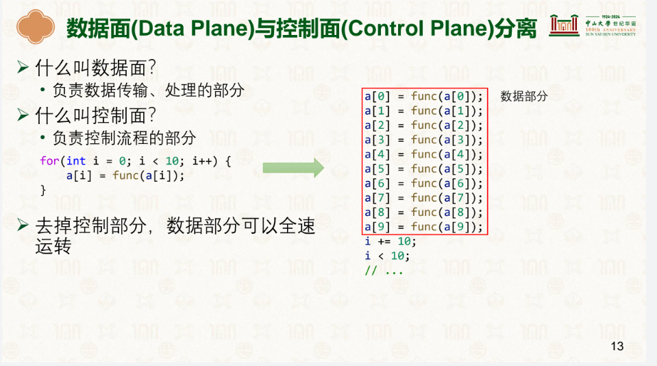
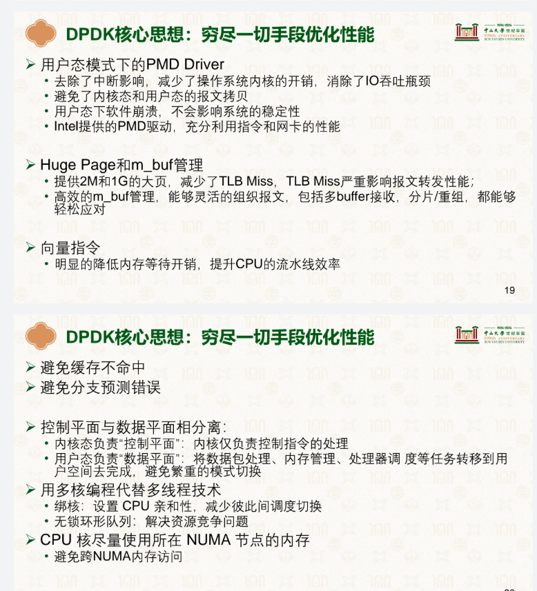

# 网络处理性能优化

## 1.网络处理性能挑战

### 1.1 网络设备速度飞速发展

网络设备的速度正经历着指数级跃迁，从早期的百兆（100Mbps）、千兆（1Gbps）以太网，一路跃升至万兆（10Gbps）、四十千兆（40Gbps）。如今，200Gbps与400Gbps已成为高性能数据中心的新常态，而技术前沿更已突破800Gbps，并向着1.6Tbps的下一代标准迈进。这种迅猛的增长，对以通用性著称的Linux内核网络协议栈的数据处理能力提出了前所未有的严峻挑战。

### 1.2 Linux网络协议栈的问题

回顾网络包接收的处理流程图


随着网络设备性能越来越强劲，就连服务器端的 Linux 内核协议栈都出现 了性能瓶颈。人们认真分析了 Linux 内核的特点，得出如下基本观察：

> 中断处理

在标准的以太网网络中，一个网络报文所能携带的“有效数据”最大为 `1500 字节`（MTU），在1.6 Tbps链路上每秒的数据包数量

在高速网络中，数据包处理能力通常以每秒数据包数量（Packets Per Second, PPS）来衡量。MTU=1500字节表示每个IP数据包的最大大小为1500字节（包括IP头和TCP头，但有效载荷可能更小）。

- **链路带宽**：1.6 Tbps = 1.6 × 10¹² bits per second。

- **每个数据包的大小**：1500字节 = 1500 × 8 = 12,000 bits（这是IP包的总大小，不包括以太网帧开销）。

  - 实际中，以太网帧还包括帧头（如MAC地址、类型字段）和帧尾（FCS），总大小约为1518字节，但计算PPS时通常使用MTU作为参考。

- **计算每秒数据包数量**：

  

  即 **大约每秒1.33亿个数据包**。

高频中断意味着高频模式切换。尽管 Linux 引入了软中断等 优化机制，但软中断的频繁调度仍导致缓存一致性（Cache Coherence）、 锁竞争（Lock Contention）等一系列压力。

> 上下文切换

在处理器核心 0 上触发网络中断处理函数，在核心 1 上进行内核态的协议栈处理，在核心 2 上完 成用户态（如 Web 服务器）的处理逻辑，线程间的调度产生频繁上下文切换开销。

> 内存拷贝

数据从网卡通过DMA的方式传到内核缓冲区，再从内核空间拷贝到用户空间， 占据Linux 内核协议栈数据包整个处理流程的 57.1%

> 内存管理

Linux 系统默认使用 4KB 的分页配置，由于 TLB 缓存空 间有限，TLB 映射条目的频繁变更会产生大量的 TLB miss。

>  局部性失效

数据包处理可能跨多核：导致CPU 缓存失效，空间局部性差

## 2.基于硬件实现的网络加速方案

### 2.1 巨帧（Jumbo Frames）

巨帧可以将数据帧的长度从 1500 字节提升到 4074 字节甚至 9000 字节（不考虑尾部）。根据 TCP/IP 协议，数据帧头部的 长度已经固定，巨帧可以让数据帧的有效载荷大大增加，通过更少的传输次数 传输更多字节。目前巨帧主要用于数据中心内部的网络。由于互联网标准已经 数据帧的最大传输单元（Maximum Transmission Unit，MTU）规定为 1500 字 节，从数据中心发往互联网的数据帧需要重新调整为 1500 字节。

### 2.2 Receive-side Scaling（RSS）

为了利用处理器的多核算力，网卡引入 了 RSS 技术，又称**“多队列网卡”**，允许将网卡上的不同接收队列分配给不同 的 CPU 核心进行处理，从而共同分担网络收包的压力。例如 FlexNIC [11] 观 察到数据中心众核的发展趋势，利用网卡 RSS 技术提升了网络应用吞吐能力 在多核上的可扩展性。RSS 通常会结合一定哈希算法，做多核心间网络处理 上的负载均衡。在实际应用中，系统还会将 RSS 限制在有限几个处理器核心 上，避免网络中断给整体系统计算带来的影响。

### 2.3 Remote Direct Memory Access（RDMA）

RDMA远程**DMA**技术

传统网络协议栈经过数十年 的发展已经变得十分臃肿，由此给网络收发包带来了不小的协议开销。RDMA 技术则是通过硬件协议访问远端节点内存，同时绕过本地和远端服务器的内核 网络协议栈，从而提供高带宽和低时延的优势。如下图所示，本地应用程序 可以通过 RDMA 网卡（RDMA NIC，简称 RNIC）在没有远端节点参与的情况 下直接发起对远端内存的读写请求，访问远端用户态的地址空间。基于这一特 性，学术界出现了不少网络应用的加速工作，如 Wukong [18] 利用 RDMA 来 加速对 RDF 的查询；FaSST [10] 使用 RDMA 优化过的 RPC 库来支持分布式 事务处理等。


RDMA 方式绕过了双方的操作系统内核，因此具有更好的性能优势。

## 3.基于软件实现的网络加速方案

### 3.1 中断优化

当中断的触发非常频繁时，处理器会疲于应付“中断风暴”的处 理。中断优化的有效机制之一就是将多个连续中断进行合并（Interrupt Coalescing），即等网络包积累到一定程度再产生一个中断，通知网卡驱动进行处 理。之前介绍的 Linux NAPI 也可以视为中断优化的一种，**触发中断后则转为轮询模式**，从而降低整体中断的数量，避免后续中断对系统性能造成的影响。

### 3.2 用户态协议栈

对于传统的宏内核系统（如 Linux 发行版和 FreeBSD）而 言，内核负责整个网络通信的命令控制和数据转发，所有的数据都需要通过 内核来传递。而“用户态协议栈”优化的核心思想就是**在网络的数据路径中彻底绕过内核**（Bypass-Kernel）。如系统国际顶级学术会议 SOSP 1995 年的 U-Net，将协议栈运行在用户态中，同时对网络接口进行虚拟化，允许多个应用通过多路复用接口直接访问网卡数据，实现了网络包在应用和网卡之间的零拷贝。

类似的代表性工作还有 Intel 主导的 DPDK 、腾讯云团队的 F-Stack以及 Linux 基金会的 Vector Packet Processing (VPP) 。谷歌 Snap 网络系统的研发人员发现，采用用户态协议栈，**还能实现网络功能 与 Linux 内核和用户应用的解耦，实现独立的开发、部署、运维和更新。**

### 3.3 网络系统优化设计实现：控制面与数据面分离



通用的思想：控制面和数据面分离，利于提高数据面的处理效率


操作系统负责充当控制平面，用于搭建网卡到应用之间的连接通道；而网络网络包则在应用和网卡之间进行移动。通过这样的设计，将操作系统内核从网络处理的“快速路径”（Fast Path）中移除，使得数据中心内部的网络吞吐量大大提 高，甚至解决了 C10K 问题，即如何使单台机器能够支持 1 万个并发 连接请求。

### 3.4 软件加速网络案例分析：Intel DPDK

Intel 联合其他厂商提出了一套全新的高效转发网络 包的数据平面开发套件（Data Plane Development Kit），简称 DPDK。不 同于 Linux 内核协议栈，DPDK 是一套绕过内核（Bypass-Kernel）的网络设 计，提供了用户态网络包的高效处理，方便开发各类高速转发的应用程序。


DPDK 充分利用了控制平面和数据平面分离的思想。首先网卡不再使用中断机制通知 CPU，因为中断本身也会产生一次模式切换，进入中断上下文； 其次 DPDK 的数据处理旁路了内核协议栈，用户态程序可以直接访问网卡队列上的网络包，实现了数据零拷贝。


如下，我们介绍 DPDK 中性能优化的主要技术点。

> 用户空间驱动（UIO）

UIO 是 Linux 提供给运行在用户空间的驱动代码访问设备 I/O 区间的机制。对于注册好的 UIO 设备，Linux 内核会对用户空间暴露/dev/uioX 文件 接口，对该文件的读写就是对设备内存的读写访问。借助 UIO 机制，DPDK 可 以绕过内核协议栈直接和网卡交互，收发并处理网卡收发队列上的数据帧。除 了 UIO 机制外，DPDK 还能通过 VFIO 实现用户态的 IO 驱动。VFIO 需要虚 拟化的支持，借助 IOMMU 实现用户态的隔离。


> 轮询模式驱动

在传统的网络收包处理过程中，每当网卡设备收到一个新的数据帧后，都会向处理器发送一个中断。网卡中断的频繁请求会不断打断处理器的正常计算过程，导致网络应用性能的极大降低。为此，DPDK 设计了使用轮询模式的 PMD（Poll Mode Drivers）网卡驱动。其思路和 NAPI 十分类似，即当第一次中断通知到来后切换为轮询模式收包。

> 任务绑核

操作系统在运行过程中可能对任务进行迁移。当任务跨核迁移时，原有核 心上的缓存数据将被清除（Cache Flush）。线程跨核调度和调度后的缓存缺失都会导致新的开销。DPDK 借助 pthread 线程库将任务线程和 CPU 进行亲和性（Affinity）绑定，避免被调度器跨核迁移造成的性能损失。

> 大页内存

操作系统默认使用 4KB 大小的标准页。当需要映射的表项非常多时，会导 致 TLB 缓存项的资源紧张，产生频繁的 TLB miss。大页机制允许一个 TLB 缓存项指向更大区域的 2MB 页面，通过减少 TLB 项的使用来提高 TLB 的命 中率。DPDK 使用 Linux 提供的“持久性大页”（Persistent Huge Pages），持 久性大页不会发生换页，而是永远驻留在内存上，因此不会导致内存访问时的 缺页中断，也能提高性能。DPDK 在大页的基础上实现了内存池（Mempool）， 用于网络包的管理。内存池的内存分配是 NUMA 感知的，避免跨节点内存访问带来的延迟影响。

> 内存对齐


同一个通道(Channel)内的数据不能被同时获取，连续的两个数据包会被分配在不同的两个通道中，实际数据包大小按照标准单元划分，实际大小不足做对齐

> 无锁环形队列

DPDK 使用了无锁技术实现了无锁队列 rte_ring，能够支持多写者/多读者模型。写者和读者间可以在不同核心上并行而不必加锁。无锁设 计使用硬件原子指令和内存屏障来保证并行结果的正确性。对于队列 的enqueue()和dequeue()操作上，DPDK 使用了批处理技巧，即将多个对 象用一个操作来完成。



### 3.5 无锁环形队列的实现思想

> 环形缓冲区结构


空闲部分：生产者头到消费者尾

数据部分：消费者头到生产者尾


> 生产者入队

0.检查队列是否已满


1.预留空间


```c
//生产者通过原子CAS操作竞争移动prod_head，预留连续槽位。
do {
    old_head = r->prod_head;
    new_head = old_head + n;
    if (剩余空间不足) return -ENOBUFS;
} while (!CAS(&r->prod_head, old_head, new_head));
```

2.写入数据

生产者将数据复制到预留槽位（内存拷贝或指针存储）。

3.提交发布


```c
//按顺序更新`prod_tail`，表示数据就绪：
while (r->prod_tail != old_head) 
    PAUSE(); // 等待前序生产者提交
r->prod_tail = new_head; // 发布数据
```

> 消费者出队

0.检查队列是否为空


1.预留数据


```c
//消费者通过CAS竞争移动cons_head，预留连续数据：
do {
    old_head = r->cons_head;
    new_head = old_head + n;
    if (可用数据不足) return 0;
} while (!CAS(&r->cons_head, old_head, new_head));
```

2.读取数据

从预留槽位复制数据到用户缓冲区

3.提交释放


```c
//按顺序更新cons_tail，释放槽位
while (r->cons_tail != old_head) 
    PAUSE(); // 等待前序消费者提交
r->cons_tail = new_head; // 释放槽位
```

>  关键协作逻辑

1. **空间判断**
   - **空闲空间** = `[cons_tail, prod_head)` 之间的槽位（需考虑环形回绕）。
   - **可用数据** = `[prod_tail, cons_head)` 之间的槽位。
2. **指针更新顺序**
   - **生产者**：`prod_head`（预留） → 写数据 → `prod_tail`（提交）
   - **消费者**：`cons_head`（预留） → 读数据 → `cons_tail`（释放）
3. **并发冲突范围**
   - **生产者间冲突**：仅通过 `prod_head` 的CAS竞争（消费者同理`cons_head`）。
   - **生产者和消费者无直接冲突**：
     - 生产者修改 `prod_head`/`prod_tail`，消费者修改 `cons_head`/`cons_tail`，互不干扰。

> 多生产者入队 多消费者出队

？？？